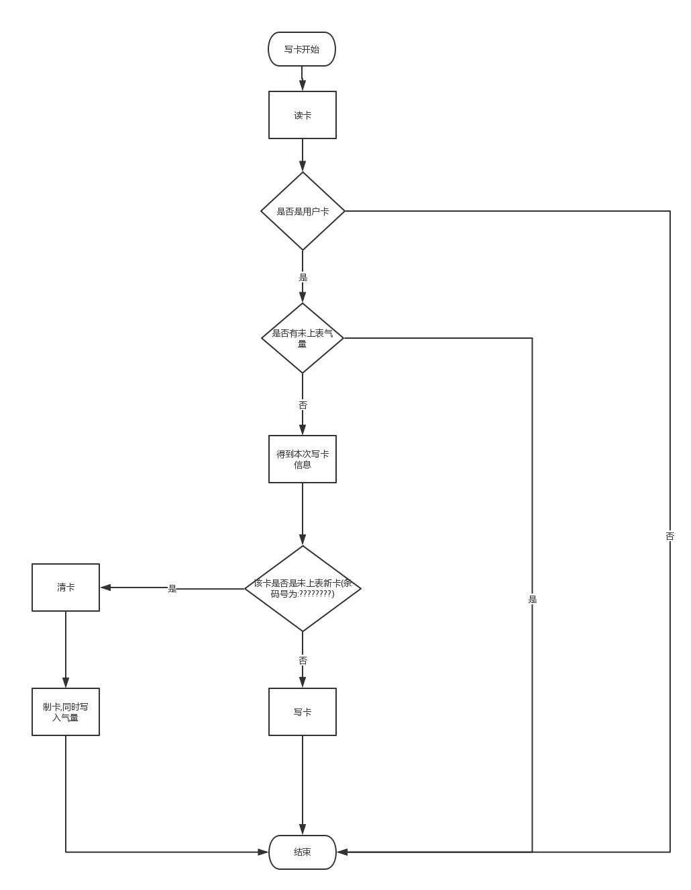

# 开燃云集云平台智能卡接入文档

| 日期         | 版本   | 描述   | 作者       |
| ---------- | ---- | ---- | -------- |
| 2018-01-04 | V1.0 | 初版   | 王磊，谢地，张胜 |

# 概述

本文档用于说明同开燃云集燃气云平台进行对接的智能卡读写设备的操作接口。

我们建议采用明华读写器(型号为：SRD-U100明华无驱读卡器，或与SRD系例兼容的读卡器)作为读写设备。

读写设备的设备号（short com指的是串口号）参数，用于操作相应的读写设备，IC卡库可以内部自行管理串口句柄。

对于有认证文件的IC卡库，需要把认证文件的访问路径固定为C:\CardReaderService，否则不能访问。

以下各函数的参数标记为IN的是输入参数，标记为OUT 的是输出参数。对于无法提供的输出参数输出为空字符串。

各函数参数的格式和次序不能改变。各函数参数的数量原则上不能改变。若有本接口中未包含的写卡参数，可以修改函数说明添加到对应的函数中。

各函数返回的响应码参见本文最后的“智能卡管理系统操作返回码”。

# 接口说明

## 1.读卡函数  

  功能：读出卡内数据，包括用户卡号、气量等。  
```
int __stdcall ReadGasCard(short com, long baud,short *klx, short *kzt, char *kh,char *tm, INT32 *ql, INT32 *cs,INT32 *ljgql, INT32 *bkcs, INT32 *ljyql, INT32 *syql);
```
  参数：
```
串口号（IN）
波特率（IN）
卡类型（OUT）:80
卡状态（OUT）:未上过表的用户卡,该字段为０，否则为１
用户卡号（OUT）: 对于新卡，该字段
表条码（OUT）：上表后的用户卡，表条码应当为表的表钢号，未上表的新卡，此字段为`????????`
气量（OUT）: 上次购气量
购气次数（OUT）: 累计购气次数
累计购气量（OUT）: 如表累计购气30方，则该字段值为30
补卡次数（OUT）：白卡的补卡次数为０，上过一次表的卡的补卡次数为１
表内累计用气量（OUT）: 写卡后该值为0,否则为表内累计用气量，如表内累计计用气30方，该值应为3000
表内剩余气量（OUT): 写卡后该值为0,否则为表内剩余气量，如表内剩余气30方，该值应为3000
```
另外，(表内累计用气量/100+表内剩余气量/100)的值域为: [累计购气量,累计购气量-1]

  返回值：

```
0：操作成功。
其它值：操作失败，见“返回值定义”。  
```


## 2.写新卡函数  
  功能：将开户卡或用户卡数据写入已格式化的新卡中。根据卡类型和卡状态确定写数据的格式。用户卡号、气量是必须使用的参数。  
```
int __stdcall WriteNewCard(short com, INT32 baud,short klx, short kzt, unsigned char *kh,unsigned char *tm, INT32 ql, short cs,INT32 ljgql, short bkcs, INT32 ljyql); 
```
  参数：
```
串口号（IN）
波特率（IN）
卡类型（IN） :80
卡状态（IN） :写新卡,该字段为０，如果是补用户已经上过表的卡，则为１
用户卡号（IN） :系统为该卡生成的卡号，8位整数
表条码（IN） :如果是写新卡，填写空字符串，如果是补用户已经上过表的卡，必须填写表的条码
气量（IN）：本次发卡气量
购气次数（IN）：新卡写１，如果是补卡，则和原来的值保持不变
累计购气量（IN）：新卡等于本次购气量，补卡和原来的保持不变
补卡次数（IN）：新卡为０，补卡＋1（例外：如果是补新卡，则该字段填写２）
表内累计用气量（IN）:0
```
  返回值：
```
0：操作成功；
其它值：操作失败，见“返回值定义”。
```


## 3.写用户卡函数  
  功能：用于用户卡购气、退气。气量大于0代表购气，气量等于0代表退气。需要验证卡内的用户卡号和地区代码是否与传入的参数值(kh,dqdm)相符合，不符合不能进行写入操作。若卡内没有地区代码，则只需要验证用户卡号相符合。用户卡号、气量是必须使用的参数。    
```
int __stdcall WriteGasCard(short com, INT32 baud, short klx, unsigned char *kh,INT16 ql,short cs,INT32 ljgql);;
```
  参数：
```
串口号（IN）
波特率（IN）
卡类型（IN）:80
用户卡号（IN）:该IC卡的卡号
气量（IN）：本次写入气量
购气次数（IN）：上次购气次数+1
累计购气量（IN）:上次累计购气量+本次写入气量
```
  返回值：
```
0：操作成功；
其它值：操作失败，见“返回值定义”。  
```


## 4.清卡函数  
  功能：将开户卡或用户卡格式化成新卡。需要验证卡内的用户卡号和地区代码是否与传入的参数值(kh,dqdm)相符合，不符合不能进行格式化操作。若卡内没有地区代码，则只需要验证用户卡号相符合。  
```
int __stdcall FormatGasCard (short com, INT32 baud);
```
  参数：
```
串口号（IN）
波特率（IN）
```
  返回值：
```
0：操作成功；
其它值：操作失败，见“返回值定义”。  
```


## 5.判卡函数  
  功能：根据卡片中的特征信息，识别插入的卡片是否为本厂商驱动支持的开户卡或用户卡，不需要识别新卡。在读卡过程中，应避免多次尝试读卡密码造成卡报废。  
```
int __stdcall CheckGasCard(__int16 com, __int32 baud);
```
  参数：
```
串口号（IN）
波特率（IN）  
```
  返回值：
```
0：本厂商驱动支持的开户卡或用户卡；
1：本厂商的工具卡；
其它值：操作失败，见“返回值定义”。
```

## 6.清0卡函数  
  功能：把表上的数据清0.  
```
int makeInitCard(short com, long baud,short klx,unsigned char *kh);
```
  参数:
```
串口号(IN)
波特率(IN)
卡类型(IN):80
卡号(IN)：该IC卡卡号
```
  返回值：
```
0：成功
其他值见返回定义
```


# 返回值  
```
-1	不是注册用户(对于有需要注册才可以使用的动态库的厂商)
-2	端口初始化失败　　　:没插读卡器返回该值
-3	读设备状态失败　
-4	无卡
-5	读卡密码次数失败
-6	该卡已经损坏
-7	读卡错误　　　:没有插卡返回该值
-8	该卡不是用户卡　　　：不是用户卡（工具卡，如清表卡）返回该值
-9	核对密码错误
-10	写卡失败
-11	备份气量不正确
-12	关闭通讯端口失败
-13	该卡可能是新卡或插反　　：卡插反了，新卡，坏卡返回该值
-14	该卡非本系统卡
-15	该卡不是新卡(只有写新卡函数需要返回该值。)
-16	用户卡号（地区代码）与卡内的值不匹配
-17	清卡失败
-18	气量超限
-19至-30	上位机系统保留返回值
```

# 业务流程简介

## 发卡/补卡

1. 读卡,判卡
2. 从后端获取写卡数据
3. 调用清卡函数
4. 调用写新卡函数

## 写卡



## 清卡

1. 读卡,判卡
2. 将卡上剩余气量或者表上剩余气量写回系统账户
3. 调用清卡函数

## 清表卡

1. 调用清0卡函数
